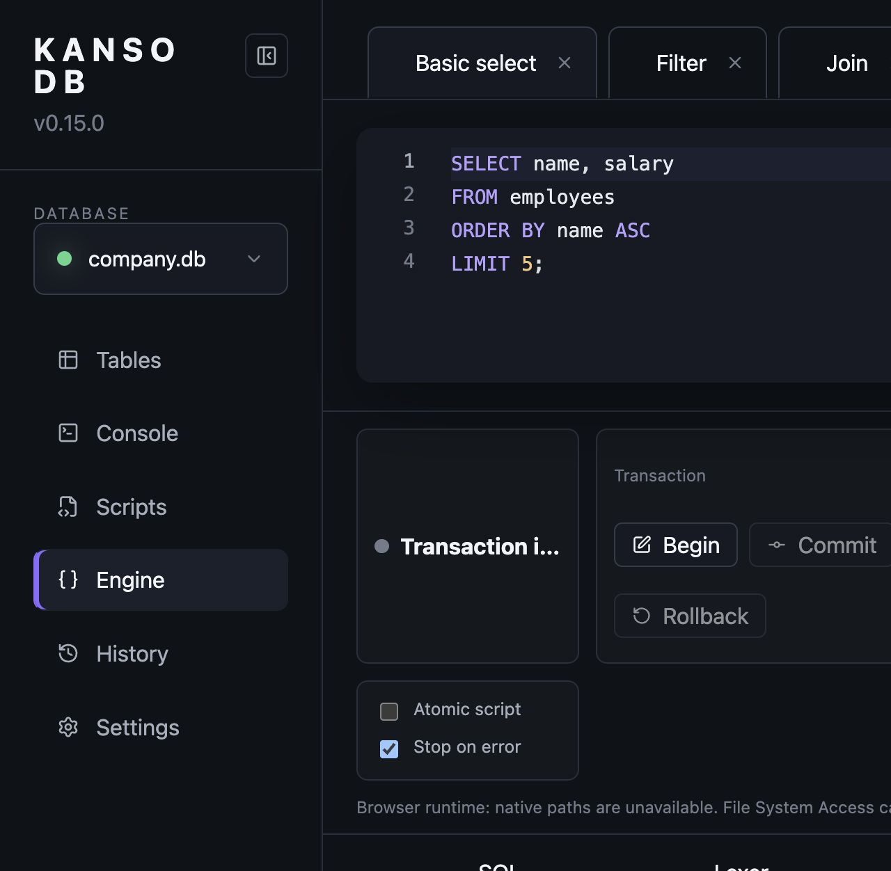
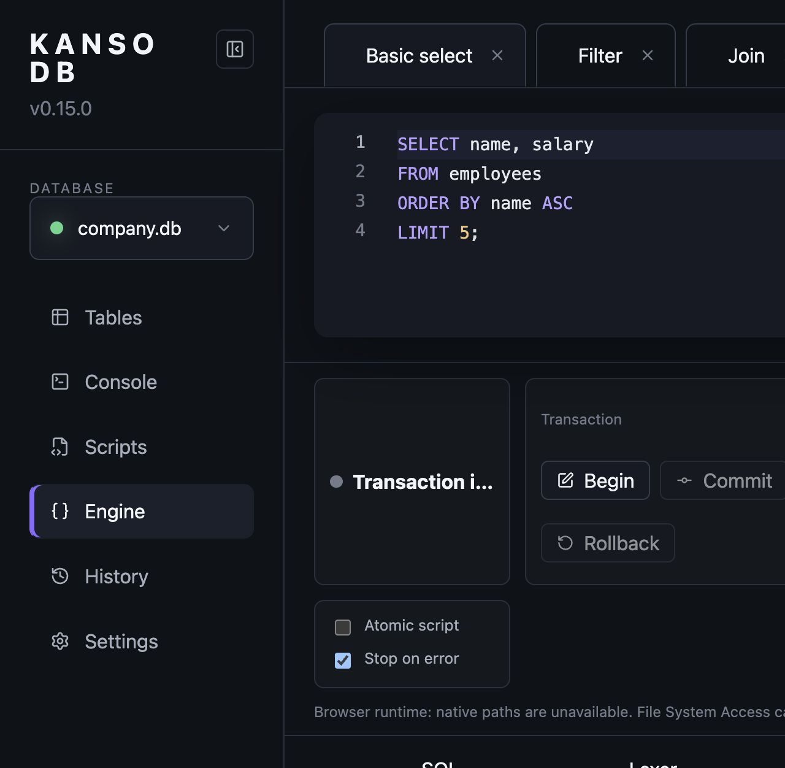

# KansoDB

> A small SQL query engine and educational database workbench built from scratch in TypeScript.

KansoDB explores how relational databases work internally: SQL text becomes tokens, tokens become typed ASTs, statements execute against in-memory tables, constraints are enforced, transactions can be committed or rolled back, and database state can be saved as versioned JSON.

The project is intentionally compact. It is built to be readable, inspectable, and useful as a portfolio-quality demonstration of language parsing, database internals, and frontend architecture.

## Screenshots





## Product Concept

KansoDB is not a PostgreSQL or SQLite replacement. It is a learning-focused SQL engine where the frontend makes normally hidden steps visible:

```text
SQL Query
  -> Lexer
  -> Parser
  -> AST
  -> Executor
  -> Storage
  -> Result
```

The workbench is designed around that idea: write SQL, execute it against the local engine, inspect tokens and ASTs, review history, and see structured errors without leaving the browser.

## Supported SQL

Current engine support includes:

* `SELECT`
* `WHERE`
* `ORDER BY`
* `LIMIT`
* joins, including `INNER JOIN` and `LEFT JOIN`
* grouping and aggregate expressions
* aliases and computed expressions
* `CREATE TABLE`
* `INSERT`
* `UPDATE`
* `DELETE`
* `BEGIN`
* `COMMIT`
* `ROLLBACK`
* `SAVE`

Supported storage features include typed columns, rows, `PRIMARY KEY`, `UNIQUE`, `NOT NULL`, foreign keys, explicit transactions, atomic scripts, and JSON persistence.

## Frontend Workbench

The frontend is a Vite React application in `frontend/`.

Key features:

* Monaco SQL editor
* query tabs with local browser persistence
* real execution through `LocalKansoClient`
* result rendering for queries, mutations, schema changes, transactions, persistence, and scripts
* engine inspection for tokens, ASTs, operators, storage events, and result summaries
* schema explorer
* query history
* structured error review
* transaction and persistence controls
* first-run onboarding
* command palette
* local UI preferences

## Engine Adapter

Frontend code depends on the `KansoClient` interface rather than backend classes throughout the UI.

The local implementation is `LocalKansoClient`, which wraps the TypeScript engine directly and maps backend objects into frontend-safe view models. Backend imports are kept inside `frontend/src/engine/`.

## Persistence Runtime

The portfolio frontend runs in the browser. It does not pretend Node filesystem paths are available.

Browser persistence uses a browser-compatible file adapter backed by local storage. The workbench displays this limitation and keeps File System Access API usage capability-gated for future import/export work.

In Node usage, `Database.open({ path })` uses the Node file adapter and writes versioned JSON files.

## Keyboard Shortcuts

| Shortcut | Action |
| --- | --- |
| `Ctrl/Cmd + K` | Open command palette |
| `Ctrl/Cmd + Enter` | Execute current query |
| `Ctrl/Cmd + T` | New query tab |
| `Ctrl/Cmd + W` | Close current query tab |
| `Ctrl/Cmd + S` | Save current query tab locally |

## Example Queries

```sql
SELECT name, salary
FROM employees
ORDER BY name ASC
LIMIT 8;
```

```sql
SELECT e.name, d.name AS department, o.city AS office
FROM employees e
INNER JOIN departments d ON e.department_id = d.id
INNER JOIN offices o ON e.office_id = o.id
ORDER BY e.name ASC;
```

```sql
BEGIN;
UPDATE employees SET salary = 1 WHERE name = 'Amira Rahman';
ROLLBACK;
SELECT name, salary FROM employees WHERE name = 'Amira Rahman';
```

## Development

```bash
npm install
npm test
npm run lint
npm run typecheck
npm run build
npm run frontend
npm run frontend:typecheck
npm run frontend:build
```

Open the frontend at the Vite URL printed by `npm run frontend`, usually `http://127.0.0.1:5173/`.

## Demo Path

For the public showcase, use the bundled **KansoDB Sample Workspace**, a small Acme Corporation database with offices, departments, employees, clients, projects, assignments, tasks, salaries, and audit events.

1. Launch the frontend.
2. Choose **Open Demo Workspace**.
3. Run the sample query tabs in this order: Basic select, High salaries, Department payroll, Employees by department, Foreign key violation, Rollback salary change.
4. Open **Engine** or **History** to inspect tokens, AST, executor operators, storage events, and result summaries.
5. Use **Save DB** to persist the browser-backed example database.

The bundled SQL lives in `examples/demo-workspace/demo.sql`, and the curated query set lives in `examples/demo-workspace/demo-queries.sql`.

The Engine view is driven by the local execution trace returned from `LocalKansoClient`; displayed durations, stage states, operators, storage events, and result summaries are not mock metrics.

## Limitations

KansoDB currently does not implement indexes, query planning, `EXPLAIN`, migrations, server APIs, authentication, encryption, replication, concurrent writers, full SQL compatibility, or production-grade filesystem locking.

The frontend does not add fake SQL features. If the engine does not support a statement, the workbench shows the real structured backend error.

## Roadmap

* Portfolio deployment
* Import/export for browser-backed database files
* Better visual screenshots and docs site
* Query planner and `EXPLAIN`
* Indexes
* Additional SQL expressions
* CLI polish

## License

MIT
